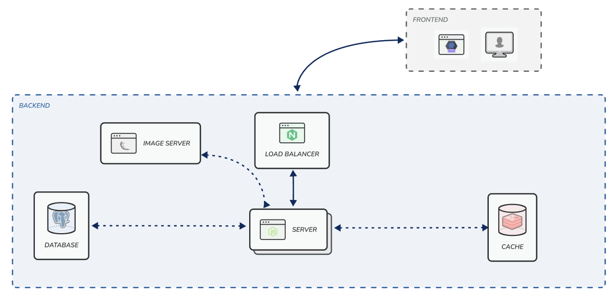
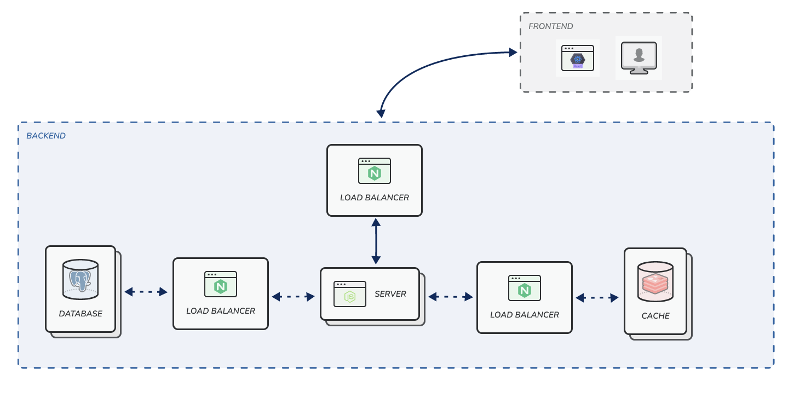
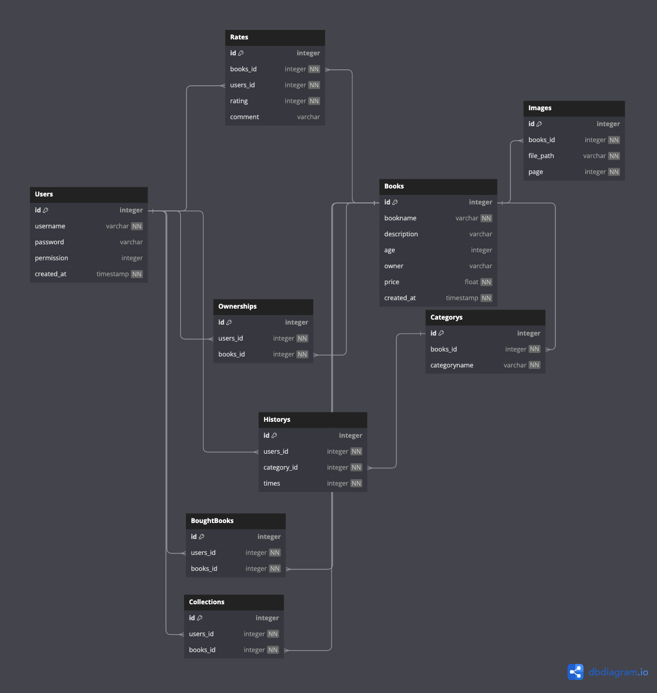

# Backend

## Installation
```bash
$ yarn install
```

No yarn? 
```bash
$ npm install -g yarn
```

No npm? go download XD

## Build Docker-compose
```bash
$ cd Docker
$ docker-compose up -d --build
```

## Run

```bash
$ yarn start
```

## Framework
* express & nodemon
    * Web server Framework 
* glob
    * Match files using the patterns the shell uses.
    * Better File Structure of Project
* prisma
    * ORM for database
* crypto
    * for generating token
* cors
    * Enable cross-origin resource sharing
* cookie-parser
    * enable cookies
* express-session
    * enable session to achieve stateful
* bcrypt (not installed)
    * Password hashing for user
* axios
    * API handler
* redis, connect-redis
    * Caching request + session
* multer
    * Upload File Handler
* swagger-jsdoc
    * API documentation generator
    * https://www.npmjs.com/package/swagger-jsdoc

## Deployment
* kubernetes
    * automating deployment, scaling, and management of containerized applications
* Nginx
    * Load Balancer

## System Architecture

### Basic Architecture



### Advanced Architecture (future work)



## Database relation
https://dbdiagram.io/d/654ba0a67d8bbd6465c4d66c

TBD (will changes to eliminate array)


Model file will located at `prisma/schema.prisma`

## Class/Module Functionality

### Status Code
* 200 OK 
    * Request sucessfully process
* 400 Bad Request
    * Invalid request format
    * e.g., loss some field in request body
    * e.g., wrong type of field (expected integer, but alphabet involved)
* 401 Unauthorized
    * Return this if user doesn't login
* 403 Forbidden
    * Return this if user doesn't have such permission
    * e.g., read after 4 pages while doesn't login
    * e.g., try to read the book which doesn't purchased
* 404 Not Found
    * Return this if data not found.
* 500 Internal Server Error
    * Return this if unexpected thing happended.

### Permissions
* 0 -> No login, Guest Login
* 1 -> Logined, normal users
* 2 -> member PRO, membership users, allow to upload books and sell
* 8787 -> Only Admin :D, only be set while initialize database

### Users

#### Register
Register user account.
##### HTTP Request
```html
POST /register
```
##### Request body
```json
{
    'username': <string>,
    'password': <password>
}
```
##### Response body
```json
{
    user: <Users>
}
```

#### Login
login a user account.
##### HTTP Request
```html
POST /login
```
##### Request body
```json
{
    'username': <string>,
    'password': <password>
}
```
##### Response body
```json
{
    user: <Users>
}
```

#### Get Current User
get current user information after login (with session)
##### HTTP Request
```html
GET /
```
##### Request body
```json
{ }
```
##### Response body
```json
{
    user: <Users>
}
```

#### Edit User Information
edit user account. **Frontend must set username as default in form**
##### HTTP Request
```html
PUT /
```
##### Request body
```json
{
    'username': <string>,
    'old_password': <string>,
    'new_password': <string>
}
```
##### Response body
```json
{
    user: <Users>
}
```

#### Add Member
Edit a user to member PRO (permission set to 2). **Note that only admin can do this**
##### HTTP Request
```html
POST /<id>
```
##### Request body
```json
{}
```
##### Response body
```json
{
    user: <Users>
}
```

### Books

#### Get All Books
Return all books
##### HTTP Request
```html
GET /
```
##### Request body
```json
{}
```
##### Response body
```json
{
    book_list: [
        <Book>,
        <Book>,
        ...
    ]
}
```

#### GetRecommendBooks
Return recommend books
##### HTTP Request
```html
GET /recommends
```
##### Request body
```json
{}
```
##### Response body
```json
{
    book_list: [
        <Book>,
        <Book>,
        ...
    ]
}
```

#### GetBooksByCategorys
Return books by category filter (*can be seen as getAllBooks with additional filter*)
##### HTTP Request
```html
GET /category/:category_id
```
##### Request body
```json
{
    Categorys: [ 
        <category_id>,
        <category_id>,
        ...
    ]
}
```
##### Response body
```json
{
    book_list: [
        <Book>,
        <Book>,
        ...
    ]
}
```

#### GetCollectionBooks
Get Collection Books for current user
##### HTTP Request
```html
GET /collections
```
##### Request body
```json
{}
```
##### Response body
```json
{
    book_list: [
        <Book>,
        <Book>,
        ...
    ]
}
```

#### GetBooksByAgeRange
Return books that have age lies on the range
##### HTTP Request
```html
GET /age/<age1>/<age2>
```
##### Request body
```json
{}
```
##### Response body
```json
{
    book_list: [
        <Book>,
        <Book>,
        ...
    ]
}
```

#### GetBooksByPriceRange
Return books that have price lies on the range
##### HTTP Request
```html
GET /price/<price1>/<price2>
```
##### Request body
```json
{}
```
##### Response body
```json
{
    book_list: [
        <Book>,
        <Book>,
        ...
    ]
}
```

#### GetPurchasedBooks
Return purchased books of current users
##### HTTP Request
```html
GET /purchased
```
##### Request body
```json
{}
```
##### Response body
```json
{
    book_list: [
        <Book>,
        <Book>,
        ...
    ]
}
```

#### Create Books
Create a books. Note that only member PRO can use this function 
##### HTTP Request
```html
POST /
```
##### Request body
```json
{
    'bookname': <string>,
    'description': <string>,
    'category_names': [
        <string>,
        <string>,
        ...
    ],
    'images': [
        <binary>,
        <binary>,
        ...
    ],
    'age': <integer>,
    'price': <float>,
}
```
##### Response body
```json
{
    book: <Book>
}
```

#### Purchased Books
Purchased a books.
##### HTTP Request
```html
POST /purchased/<book_id>
```
##### Request body
```json
{ }
```
##### Response body
```json
{
    book: <Book>
}
```

#### add Books to Collection
Add a books to collection
##### HTTP Request
```html
POST /collection/<book_id>
```
##### Request body
```json
{ }
```
##### Response body
```json
{
    book: <Book>
}
```

#### Edit Books (only content)
Edit the information of book (only author can edit! owner.id === request.session.user.id)
##### HTTP Request
```html
PUT /edit/<id>
```
##### Request body
```json
{
    'bookname': <string>,
    'description': <string>,
    'category_names': [
        <string>,
        <string>,
        ...
    ],
    'age': <integer>,
    'price': <integer>
}
```
##### Response body
```json
{
    book: <Book>
}
```

#### Delete Books
Delete the book (Only author can do this)
##### HTTP Request
```html
DELETE /<book_id>
```
##### Request body
```json
{ }
```
##### Response body
```json
{ }
```

### Rates

#### Get Book Rating
Return the rating of the book by id requested
##### HTTP Request
```html
GET /<books_id>
```
##### Request body
```json
{}
```
##### Response body
```json
{
    rating: <float> (Average of all the rating)
}
```

### Content/Image

#### GetBooksContentById
Return the images (content) of the book by requested pages id
##### HTTP Request
```html
GET /<books_id>/pages/<image_id>
```
##### Request body
```json
{}
```
##### Response body
```json
{
    'content': <image/binary>
}
```

#### EditBooksContentById
Edit book's content by per images. Only Author can use this function.
##### HTTP Request
```html
PUT /<book_id>/pages/<image_id>
```
##### Request body
```json
{
    'content': <binary/image>
}
```
##### Response body
```json
{}
```

### Category

#### Create Category
Create a new category (only member PRO are allowed)
##### HTTP Request
```html
POST /
```
##### Request body
```json
{
    'categoryname': <String>
}
```
##### Response body
```json
{
    category: <Categorys>
}
```

#### Get All Category
Get existed category
##### HTTP Request
```html
GET /
```
##### Request body
```json
{ }
```
##### Response body
```json
{
    category_list: [
        <Categorys>,
        <Categorys>,
        ...
    ]
}
```

## Image Server Communications
> Use `axios` to send API request to image server

#### Get Images
get image
##### HTTP method
```
GET /image
```
##### HTTP Request
```json
{
    "path": <string> 
}
```
##### HTTP Response
```
image/png or image/jpg or image/jpeg
```

#### save Images
save image at image server
##### HTTP method
```
POST /image/<owner_id>
```
##### HTTP Request
```
form-data
file: <image>
```
##### HTTP Response
```json
{
    "content_type": <mimetype>,
    "path": <string>,
    "uuid": <string>
}
```

#### save multiple image in one request
##### HTTP method
```
POST /images/<owner_id>
```
##### HTTP Request
```
form-data
file: <image>
file1: <image>
...
file<n>: <image>
```
##### HTTP Response
```json
{
    "file_key": <string>,
    "file_name": <string>,
    "content_type": <mimetype>,
    "path": <string>,
    "uuid": <string>
}
```

#### delete single image
##### HTTP method
```
POST /delete/image
```
##### HTTP Request
```
{
    "path": <string>,
}
```
##### HTTP Response
```json
{ }
```

#### edit (replace) single image
##### HTTP method
```
POST /edit/image/owner_id
```
##### HTTP Request
```
form-data
path: <string>,
file: <image>
```
##### HTTP Response
```json
{
    "content_type": <mimetype>,
    "path": <string>,
    "uuid": <string>
}
```


## API Spec (WILL BE DONE AFTER FINISH)
TODO with swagger

## TODO:

1. Connect with Redis
2. Build Nginx ingress 
3. Backend wrap with docker-network