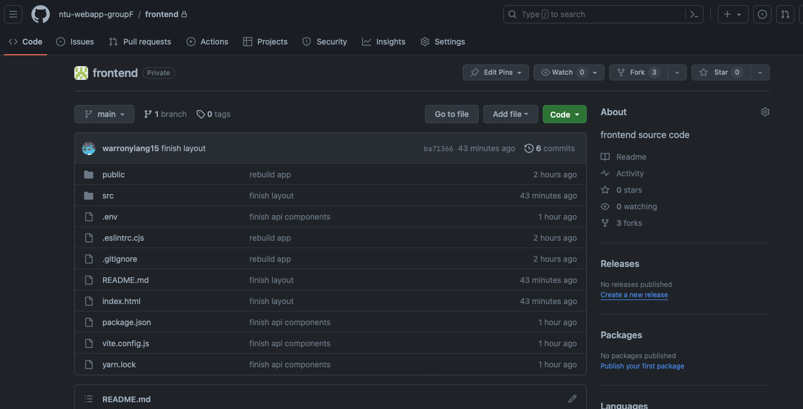
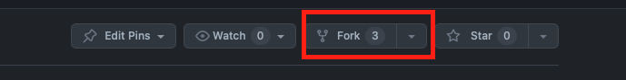
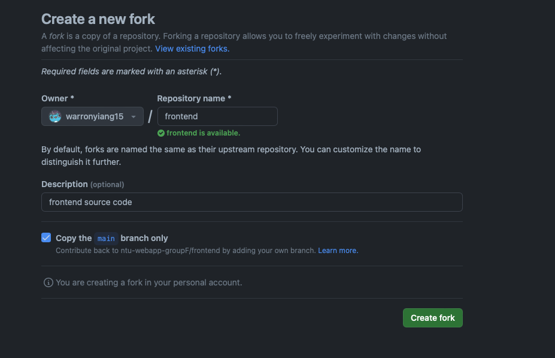
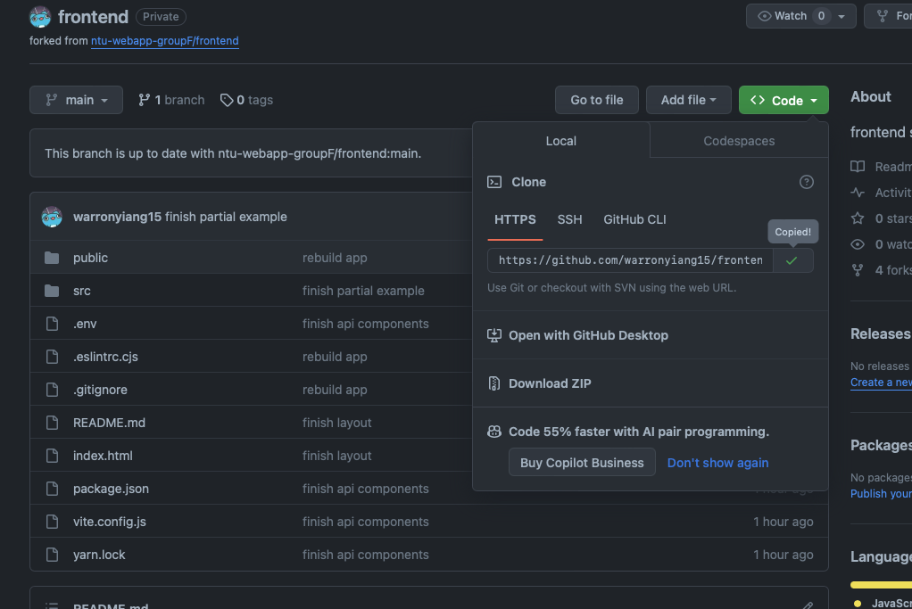
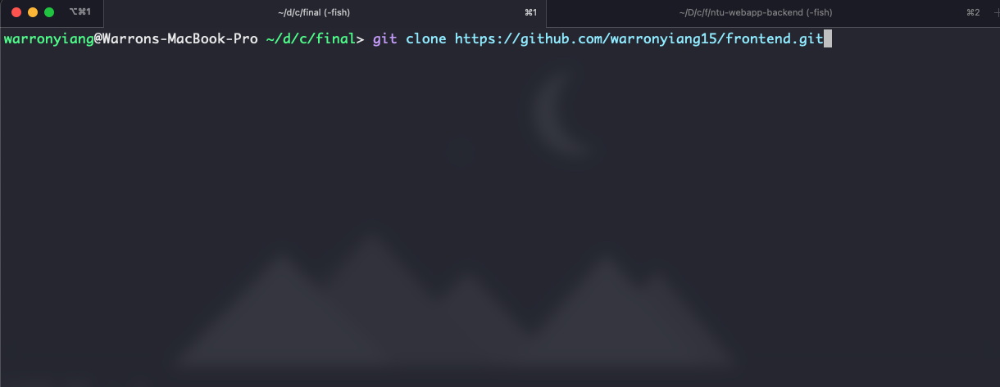
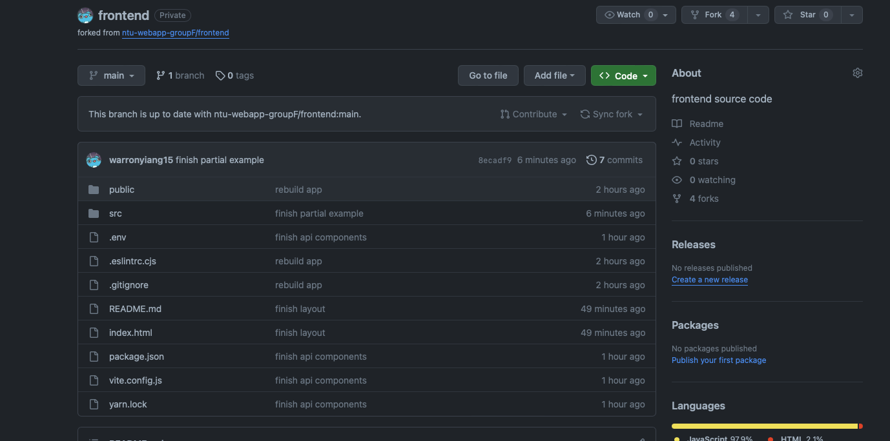
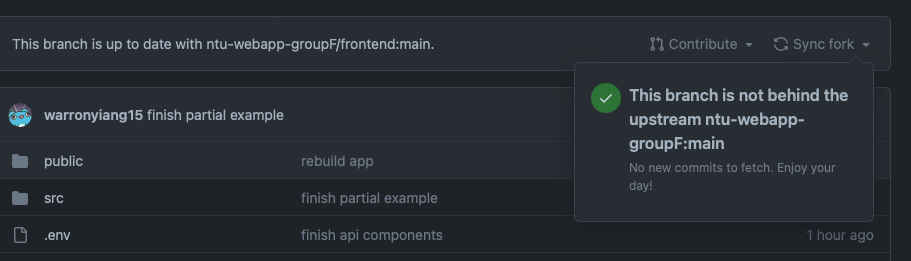
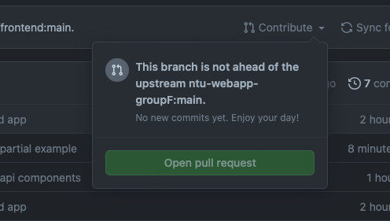

# README for development

## Github Setup
1. 首先去 https://github.com/ntu-webapp-groupF/frontend 

2. 然後點擊 `Fork` 

3. 按 `Create fork`

4. 應該會自動到 fork 出來的 repo，這時就把這個repo git clone 下來

5. CLI

6. 接下來就專注在更改這些code上
7. 當你完成了一部分後，可以用 `git add .` -> `git commit -m [message]` -> `git push` 上去
8. 然後每次 `push` 之前最好都先做例行檢查動作，或應該說最好每次要更改code前後都做例行檢查

### 例行檢查動作
1. 首先去到 第4步驟你fork出來的repo

2. 按 `Sync fork`，檢查目前的branch是否為最新的版本，如果是最新的話就會顯示以下的內容，如果不是最新的話就會叫你按一個button，按下去就對了，按了後記得要再 `git pull`

3. 當你做完了東西後，並且 `git push` 了後，記得一樣到這裡並按 `Contribute` -> 按 `Open pull request` ，然後照著給你的指示填寫然後發 `pull request`

4. `pull request` 是讓admin可以知道你目前的進度到哪裡，並且你改了哪些文件。當admin接受你的更動/更新後，你就要再做一次第二步驟

## Start
1. in terminal, type `yarn` and enter
2. type `yarn dev`
3. visit `http://localhost:5173` to see your website

## Frontend Path
* `http://localhost:5173` -> 主頁，使用者點進來網頁看到的畫面
* `http://localhost:5173/users/login` -> Login Page
* `http://localhost:5173/users/register` -> Register Page
* `http://localhost:5173/member` -> Member Page，會員畫面
* `http://localhost:5173/books` -> 登入成功後會看到的畫面，推薦書的那個畫面
* `http://localhost:5173/books/filter` -> 當使用者使用 filter 功能的時候的畫面，如搜尋特定的繪本，看已收藏的繪本，已經購買的書本等等...
* `http://localhost:5173/reads` -> 看繪本內容的畫面
* `http://localhost:5173/edit` -> Profile Page
* `http://localhost:5173/edit/profile` -> 使用者更改自己的資訊的畫面
* `http://localhost:5173/edit/book` -> 創建一本繪本的畫面
* `http://localhost:5173/purchase` -> 購買書本時的畫面

## Get data from backend
### What function and defined at where?
checkout `/src/api/{book, category, content, rate, user}.js`
### How to use?
import `{user, book, category, content, rate}Api` from their file. For example, if you want to login, you may implement the following code
```js
const loginUser = async (username, password) => {
    const response = await userApi.login(username, password);
    console.log(response); // response.status, response.data
    if( response.status === 200 ){
      const userData = response.data;
      // do something with userData
    } else {
      const errorMessage = response.data;
      // do something with error message sent from backend
    }
}
```
### What the structure of response
You can use `console.log` to check what will be inside the return value of function. Basically it will be defined as the following structure
```js
response.status // HTTP Status Code, 200 will be success code, otherwise error(fail)
response.data // Data sent from backend, 200 will be expected data, otherwise will be error message
```

